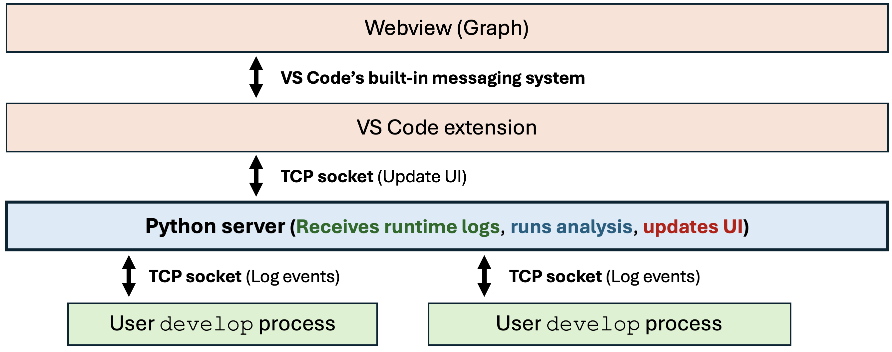

# Agent developer scratchpad

See README's in src dirs for more details.

## User workflow

We assume the user coded their workflow in Python, i.e., runs it with something like:

 - `python -m foo.bar`
 - `ENV_VAR=5 python script.py --some-flag`

All they change is the Python command. Whenever they want to develop their script with us, they run:

 - `develop -m foo.bar`
 - `ENV_VAR=5 develop script.py --some-flag`

This will feel *exactly* the same as running Python but also analyzes their code, populates our VS Code extension, etc. Specfically:

 - Program prints/reads to/from same terminal, crashes the same, etc
 - [User can use VS Code debugger](https://github.com/ferdiko/agent-copilot/blob/9af2cbc27fef1e6a0a6bb63c7ad678cf04cdb205/.vscode/launch.json#L11)

## Launch VS Code extension

Several IDEs are based on VS Code. We have successfully tried our extension in VS Code and Cursor.

### Get started

This is a temporary "get started". You should run the below steps in VS Code or Cursor:

1. Install dependencies (see "Dependencies" below).
2. Set `project_root` in `configs/copilot.yaml` to the path where your code base lives (that you want to analyze). Also set `cache_dir` and `cache_attachments`. When you send requests with attachements (e.g., query over a PDF), these parameters define if you want to cache the files so they are available when you later inspect inputs and outputs to a query. (‼️)
3. Launch explorer window with extension installed by running "Run Extension" from the debugger options (see "Launch front end" below).
4. Normally use VS Code. E.g., open folder: The repo you want to analyze
5. Run `develop script.py` to use our tool on your code base

### Dependencies
The project has python dependencies but also others (for front end). I recommend you use a conda env. Run the following in project root dir:

```
conda env create -f conda-environment.yml
conda activate scratchpad
pip install -e .
```

### Launch front end
Then see [here](/src/user_interface/README.md) to launch explorer window with extension installed.

### Start and stop server
Currently, you need to manually start and stop our server. Just do:

 - `server start`
 - `server stop`

If you make changes to the server code, you can also do `server restart` so the changes are reflected in the running server. If you want to clear all recorded runs and cached LLM calls, do `server clear`.


## Further resources

 - [Google drive folder](https://drive.google.com/drive/folders/1Syc77Cko6PFlr_wnxBMa6PB-_aXCOt1v?usp=sharing)
 - [Project description](https://docs.google.com/document/d/13L2eVu8jAGZwmgp49OoXigCrmA7CUExQOpSmC5HhDls/edit?usp=sharing)
 - [Initial brainstorming doc](https://docs.google.com/document/d/1B0YCZXxEa1St744XfLSZR2Yzt_zihRdUB-d_c1wFw3Q/edit?tab=t.0#heading=h.ltj5f1i4sgpz)


## Dev

### Architecture

These are the processes running. 

1. Run user program (green): The users launch processes of their program by running `devlop their_script.py` which feels exactly like running their script normally with `python their_script.py` --- they can also use the debugger to run their script, which also feels completely normal. Under the hood the `develop` command monkey patches certain functions and logs runtime events to the `develop server`. The `develop runner` runs the actual python program of the user. The `develop orchestrator` manages the life cycle of the runner. For example, when the user presses the restart button in the UI, the orchestrator with kill the current runner and re-launch it.
2. Develop server (blue): The `develop server` is the core of the system and responsbible for all analysis. It receives the logs from the user process and updates the UI according to its analyses. All communication to/from the `develop server` happens over a TCP socket (default: 5959). 
3. UI (red): The red boxes are the UI of the VS Code extension. The UI gets updated by the `develop server`. TODO: The VS Code extension spawn the `develop server` and tears it down. They also exchange a heart beat for failures and unclean VS Code exits.



### Keep dependencies up to date

Keep dependencies up to date:

`python create_dependency_file.py`

### Testing / Playing around

Go to `testing` dir to just try things out. See READMEs there.


### Static analysis

This is not really working as of now. It works on simple scripts but not on Amadou's code-gen (super complicated repo). We're taing different approaches right now:

pyre (TODO document and pull in):
 - We want to set llm calls as source and sink but somehow I couldn't figure out how. We now define other functions as sources and sinks and make stubs for the LLM calls (e.g., we create folder structure to exactly reflect `openai.resources.responses.responses.create` and add a the create function to contain sources and sinks for taint). However, these stubs don't work if they're just in our code base (e.g., `pyre_static_analysis`) but only worked when I placed them directly into the user repo. That sucks ...
 - Env vars: `export PYRE_VERSION=client_and_binary`

