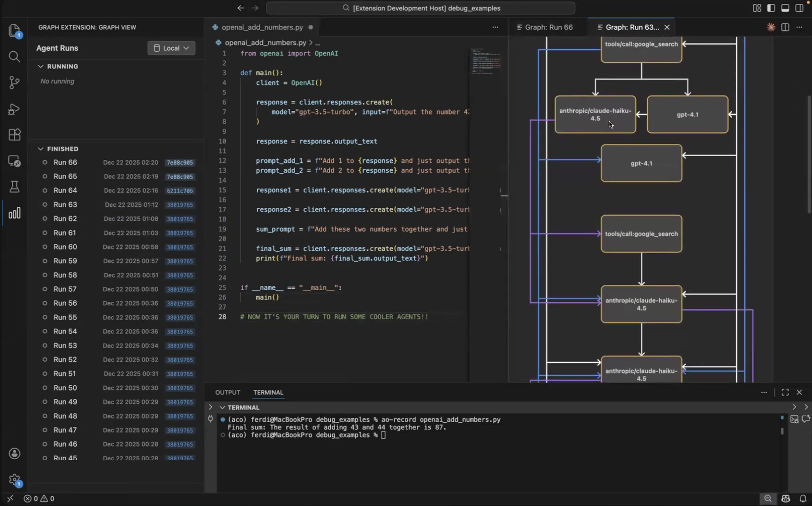

# AO Agent Dev: What-if Questions over Agent Trajectories  

AO Agent Dev is a developer tool for agent builders. It supports arbitrary Python progams (like your existing agents!) and will visualize your agent's LLM and MCP calls into a dataflow graph. You can then inspect, edit and rerun this graph and understand how to fix your agent.

[](https://youtu.be/woVctiSRJU0)


## Quickstart

`AO Agent Dev` integrates into VS Code or IDEs based on it, like Cursor. 

Simply download (1) our [VS Code Extension](https://marketplace.visualstudio.com/items?itemName=agentops.ao-agent-dev) (type ao dev into the marketplace search and install the one with the blue icon by "Agent Ops"), (2) install our pip package:

```bash
pip install ao-dev
```

**Then, give it a spin:**

1. Create a folder called `my-agent` and add a file with some LM program. For example, in the video above we use `openai_example.py` with the following content:

```python
from openai import OpenAI

def main():
    client = OpenAI()

    response = client.responses.create(
        model="gpt-4o-mini",
        input="Output the number 42 and nothing else",
        temperature=0
    )
    number = response.output_text

    prompt_add_1 = f"Add 1 to {number} and just output the result."
    prompt_add_2 = f"Add 2 to {number} and just output the result."

    response1 = client.responses.create(model="gpt-4o-mini", input=prompt_add_1, temperature=0)
    response2 = client.responses.create(model="gpt-4o-mini", input=prompt_add_2, temperature=0)

    sum_prompt = f"Add these two numbers together and just output the result: {response1.output_text} + {response2.output_text}"
    final_sum = client.responses.create(model="gpt-4o-mini", input=sum_prompt, temperature=0)

    print(f"Final sum: {final_sum.output_text}")

if __name__ == "__main__":
    main()
```

2. Run the script with python to verify it works (keys are set correctly, etc.):

```bash
cd my-agent
python openai_example.py
```

3. Run the script using ao-record.

```bash
ao-record openai_example.py
```

This should show you the example's graph (like in the video above) where you can edit inputs and outputs and rerun.

## Documentation

For complete documentation, installation guides, and tutorials, visit our **[Documentation Site](https://ao-agent-ops.github.io/ao-dev/)**.

## Building from source and developing

See the [Installation Guide](https://ao-agent-ops.github.io/ao-dev/getting-started/installation/) for development setup and the [Developer Guide](https://ao-agent-ops.github.io/ao-dev/developer-guide/architecture/) for architecture details. More details can also be found in the READMEs of the corresponding dirs in `src/`.

## Community

- [Join our Discord](https://discord.gg/fjsNSa6TAh)
- [GitHub Issues](https://github.com/agent-ops-project/ao-dev/issues)
- We're just getting started on this tool and are eager to hear your feedback and resolve issues you ran into! We hope you enjoy it as much as we do.
