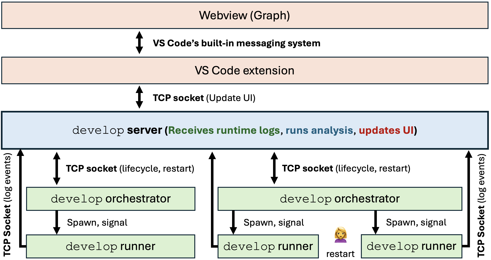

# Architecture

This page provides a high-level overview of AO's architecture and how its components work together.

## System Overview

AO consists of three main processes that work together:



### 1. User Program (Green)

The user launches their program with `ao-record script.py`. This feels exactly like running `python script.py` - same terminal I/O, same crash behavior, and debugger support.

**Components:**

- **Agent Runner** (`agent_runner.py`) - Wraps the user's Python command. Sets up the environment, connects to the server, applies monkey patches and AST rewrites, then executes the user's program.
- **AST Rewrite Hook** (`ast_rewrite_hook.py`) - Import hook that ensures AST-rewritten `.pyc` files are loaded from `~/.cache/ao/pyc`.
- **Monkey Patching** (`monkey_patching/`) - Intercepts LLM API calls to record inputs/outputs and propagate taint.

### 2. Development Server (Blue)

The core analysis engine that receives events from the user process and updates the UI.

**Responsibilities:**

- Receives LLM call events from the runner
- Builds and maintains the dataflow graph
- Manages LLM call caching
- Handles user edits to inputs/outputs
- Controls the UI

**Communication:** All messages flow through a TCP socket (default port: 5959).

### 3. UI (Red)

The VS Code extension (or web app) that displays the dataflow graph and provides interactive controls.

**Features:**

- Visualizes the dataflow graph
- Allows editing of LLM inputs/outputs
- Triggers re-runs with modifications
- Shows run history

## Data Flow Architecture

### How Taint Tracking Works

AO tracks data flow using a "taint" system:

1. **LLM Output Tainting** - When an LLM produces output, its ID is stored in `TAINT_DICT` mapping `id(obj)` to the list of LLM origins
2. **Taint Propagation** - As data flows through the program, taint information propagates through AST-rewritten operations
3. **Edge Detection** - When tainted data reaches another LLM call, an edge is added to the dataflow graph

### Two Mechanisms for Taint Propagation

1. **Monkey Patching** - Intercepts LLM API calls to:
   - Record inputs and outputs
   - Call `TAINT_STACK.read()` to discover input origins (graph edges)
   - Call `TAINT_STACK.update()` to set the current node ID for outputs

2. **AST Rewriting** - Rewrites Python code to propagate taint through:
   - All function and method calls
   - String formatting operations
   - Binary operations (+, -, etc.)
   - Attribute and subscript access

## Execution Flow

1. User runs `ao-record script.py`
2. Agent runner sets up environment (builtins, import hooks)
3. Agent runner connects to server (starts it if needed)
4. Monkey patches are applied to LLM libraries
5. User code is imported via AST rewrite hook (loads pre-compiled `.pyc` from cache)
6. User code executes with full tracing
7. LLM calls are intercepted and reported to server
8. Server builds dataflow graph
9. UI displays the graph in real-time

## Module Organization

```
src/
├── cli/                    # Command-line interface
│   ├── ao_record.py       # Main launch command
│   ├── ao_server.py       # Server management
│   └── ao_config.py       # Configuration
├── runner/                 # Runtime execution
│   ├── agent_runner.py     # Main runner (setup + execution)
│   ├── ast_rewrite_hook.py # Import hook for AST-rewritten .pyc
│   ├── taint_containers.py # Thread-safe taint storage
│   ├── context_manager.py  # Session management
│   └── monkey_patching/    # API interception
│       ├── apply_monkey_patches.py
│       └── patches/        # Per-API patches
├── server/                 # Core server
│   ├── main_server.py      # Main server logic
│   ├── ast_transformer.py  # AST rewriting
│   ├── taint_ops.py      # Taint propagation functions
│   ├── file_watcher.py     # File monitoring + git versioning
│   └── database_manager.py # Caching/storage
└── user_interfaces/        # UI components
    ├── vscode_extension/   # VS Code extension
    └── web_app/            # Standalone web app
```

## Next Steps

- [Server internals](server.md) - Deep dive into the development server
- [Taint tracking](taint-tracking.md) - How data flow is tracked
- [API patching](api-patching.md) - How LLM APIs are intercepted
