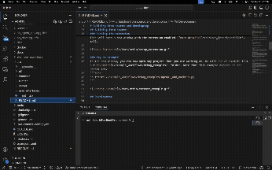
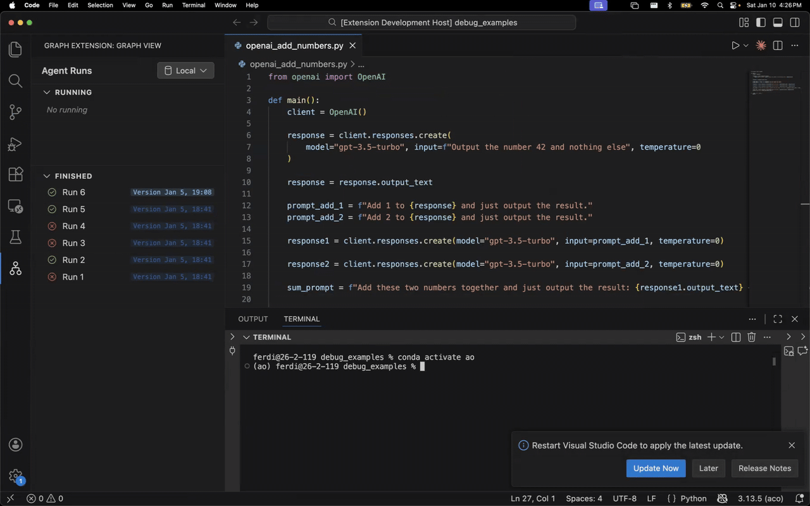

# Installation

## Prerequisites

- Python 3.10 or higher (Python 3.13 recommended)
- Node.js (for building the VS Code extension)

## Quick Install (pip)

```bash
pip install ao-dev
```

## Quick Install (uv)

If you use [uv](https://docs.astral.sh/uv/) for package management, add `ao-dev` to your project's dependencies:

```bash
uv add ao-dev
```

Then run your scripts with:

```bash
uv run ao-record script.py
```

## Verifying Installation

After installation, verify that the CLI commands are available:

```bash
ao-record --help
ao-server --help
```

## Building from Source

### Create Environment

If you're starting from a clean sheet, create a conda environment with the required dependencies:

```bash
conda create -n ao python=3.13 nodejs sqlite -y && conda activate ao
```

### Install and Build

For non-developers, install the project and build the UI:

```bash
pip install -e .
cd src/user_interfaces && npm install && npm run build:extension
```

### Running the Extension

Open this project in a new VS Code window. Select the "Run Extension" option from the debugger and run it. This will open a new window with the extension enabled.



### Try an Example

In the new window, you can now open any project that you are working on. For example, run the `openai_add_numbers.py` example from the `example_workflows/debug_examples/` folder:

```bash
ao-record ./example_workflows/debug_examples/openai_add_numbers.py
```

> **Note:** This example depends on the OpenAI API. You may need to install it first: `pip install openai`



## Developer Installation

If you are contributing to AO, install with development dependencies and set up pre-commit hooks:

```bash
pip install -e ".[dev]"
pre-commit install
cd src/user_interfaces && npm install && npm run build:extension
```

### IDE Linter Configuration

Some Python linters may incorrectly report that modules inside the codebase can't be found. Run the following in the project root to resolve this:

```bash
ln -s src ao
```

### Fetching Large Files

The repository uses Git LFS for large files (videos, etc.). After cloning, fetch them with:

```bash
git lfs pull
```

## Next Steps

- [Run your first example](quickstart.md)
- [Learn the CLI commands](../user-guide/cli-commands.md)
