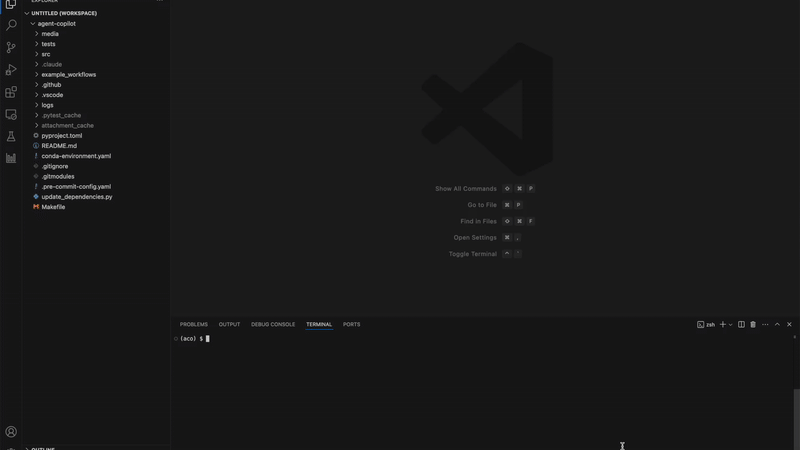

# Quickstart

This guide will get you up and running with Agent Copilot in a few minutes.

## Step 1: Start the VS Code Extension

1. Open the Agent Copilot project in VS Code
2. Select the "Run Extension" option from the debugger (found in `.vscode/launch.json`)
3. Run the debugger - this opens a new window with the extension enabled


Look for the bar chart icon in the VS Code side panel to access the extension.

## Step 2: Open Your Project

In the new VS Code window, open any Python project you want to analyze. For this quickstart, we'll use one of the included examples.

## Step 3: Run an Example

The examples require an OpenAI API key. Make sure you have `OPENAI_API_KEY` set in your environment.

Run the example from your terminal:

```bash
aco-launch ./example_workflows/debug_examples/openai_add_numbers.py
```



## What Just Happened?

When you ran `aco-launch`, Agent Copilot:

1. **Analyzed your code** - Rewrote Python files to track data flow
2. **Intercepted LLM calls** - Captured inputs and outputs from OpenAI API calls
3. **Built a dataflow graph** - Created a visual representation of how data flows between LLM calls
4. **Updated the VS Code extension** - Displayed the graph in the side panel

## Using the VS Code Extension

Once your script runs, the extension shows:

- **Nodes** - Each LLM call appears as a node
- **Edges** - Connections show data flow between calls
- **Inputs/Outputs** - Click a node to see the full prompt and response

You can:

- **Edit Input** - Modify the input to an LLM call
- **Edit Output** - Override the LLM's response
- **Re-run** - Execute again with your modifications

## Next Steps

- [Learn all CLI commands](../user-guide/cli-commands.md)
- [Explore the VS Code extension features](../user-guide/vscode-extension.md)
- [Create subruns for batch processing](../user-guide/subruns.md)
